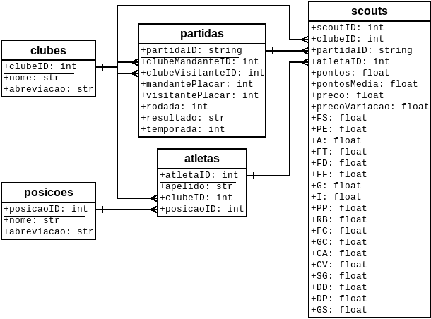
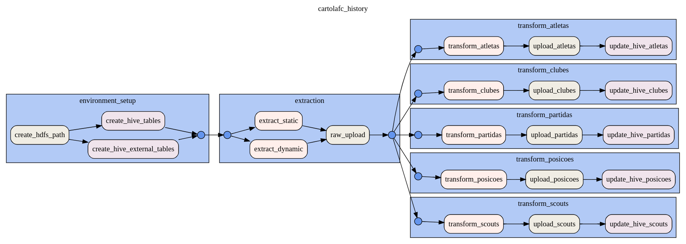

# Cartolafc reports

<p>


</p>

Thi project aims to build and structure a data lake and data warehouse based on the data extracted from Cartola FC (a game about the Brazilian national football championship). The current data warehouse schema and dag diagram are presented next:

<p align="center">

</p>

<p align="center">

</p>

## How to start

The base of components of the project is orchestrated at the `docker-compose.yaml` in the root level of the project. While some components are still not integrated, they have their own `docker-compose.yaml` located at each component folder. At the root level, hadoop and airflow are integrated. So, to setup the base project run the following:

```shell
docker-compose up --detach
```

Then, the containers of hadoop namenode and datanode, airflow scheduler, webserver and postgres will start. After some moments to start the services, you can check the web interfaces:
- Hadoop Web UI: http://localhost:9870
- Airflow Web UI: http://localhost:8080
