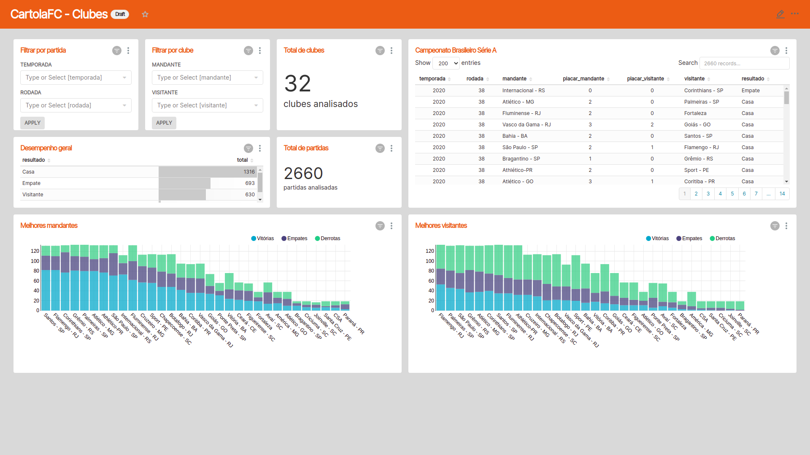
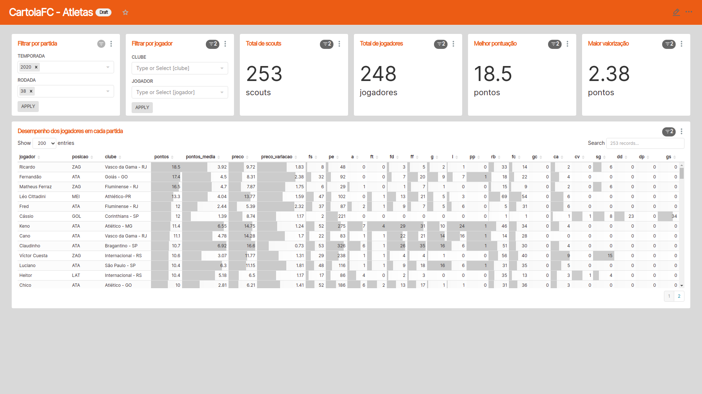

# Cartolafc reports

<p>


</p>

<p align="center">

</p>

This project aims to build and structure a data lake and data warehouse based on the data extracted from Cartola FC (a game about the Brazilian national football championship).

## How to start

The base of components is orchestrated at the `docker-compose.yaml` in the root level of the project. Services like hadoop datanode and namenode, hive server and metastore, airflow webserver and scheduler, and superset server can be found there. So, to setup the base project run the following:

```shell
docker-compose up --detach
```

Then, the containers of hadoop, airflow, hive and superset will startup. After some moments of the startup of the services, you can check the web interfaces:
- Hadoop Web UI: http://localhost:9870
- Hive Web UI: http://localhost:10002
- Airflow Web UI: http://localhost:8080
- Superset Web UI: http://localhost:8088

## Miscellaneous

The current data warehouse schema used on Hive is presented next. It mirror the trusted layer build on hadoop with external tables (this is the `trusted` schema) to make some ELT to construct the managed tables in the `refined` schema.

<p align="center">

</p>

The Airflow DAG includes tasks of environment setup in hive and hdfs, file extraction from github API and a transform/load groups for each table of the hive schema. The DAG diagram is presented next:

<p align="center">

</p>

Two dashboards are built into superset, the first with an emphasis on teams and the second on player perfomance:

<p align="center">

</p>

<p align="center">

</p>
