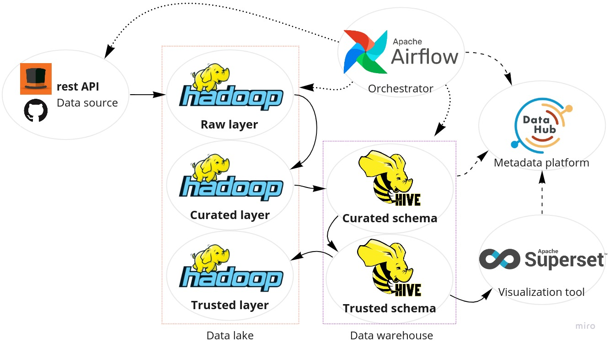

# Cartolafc reports

<p>


</p>

<p align="center">

</p>

This project aims to build and structure a data lake and data warehouse based on the data extracted from Cartola FC (a game about the Brazilian national football championship). To do it, a few services are used:

- Airflow: scheduler and task orchestrator;
- DataHub: data lineage backend and data catalog;
- Hadoop: data repository;
- Hive: database over hadoop;
- Superset: visualization tool.

## How to start

The base of components are orchestrated with docker containers in the compose files at the root level of the project. Services like hadoop datanode and namenode, hive server and metastore, airflow webserver and scheduler, and superset server can be found there. So, to create all the project components at the same time, run the following command:

```shell
docker-compose up \
    --file docker-compose.airflow.yaml \
    --file docker-compose.hive.yaml \
    --file docker-compose.datahub.yaml \
    --file docker-compose.superset.yaml \
    up --detach

# or just quickstart
./quisckstart.sh
```

To setup only the operational group of containers you will need airflow, hive, hadoop and datahub containers. So, run the following:

```shell
docker-compose \
    --file docker-compose.airflow.yaml \
    --file docker-compose.hive.yaml \
    --file docker-compose.datahub.yaml \
    up --detach

# or just quickstart
./quisckstart.sh airflow
```

To setup only the querying group of containers (superset, hive and hadoop) run the following:

```shell
docker-compose \
    --file docker-compose.superset.yaml \
    --file docker-compose.hive.yaml \
    up --detach

# or just quickstart
./quisckstart.sh superset
```

After a few moments of the start and healthcheck of services, the web interfaces will be found in:
- Airflow Web UI: http://localhost:8080
- DataHub Web UI: http://localhost:9002
- Hadoop Web UI: http://localhost:9870
- Hive Web UI: http://localhost:10002
- Superset Web UI: http://localhost:8088

## Miscellaneous

The current data warehouse schema used on Hive is presented next. It mirrors the trusted layer build on hadoop with external tables (this is the `trusted` schema) to make some ELT to construct the managed tables in the `refined` schema.

<p align="center">

</p>

The Airflow DAG includes file extraction from github API and transform/load groups for each table of the data warehouse schema. The DAG diagram is presented next:

<p align="center">

</p>

Two dashboards are built into superset, the first with an emphasis on teams and the second on player perfomance:

<p align="center">

</p>

<p align="center">

</p>

## Query examples

Some sample queries are stored in `docs/sql`. As an example, the best lineup of players based on scouts in all data since 2014:

```sql
WITH ranked_players AS (
    SELECT
        scouts.temporada,
        partidas.rodada,
        clubes.nome AS clube,
        atletas.apelido AS jogador,
        scouts.pontos AS pontos,
        scouts.pontosmedia AS media,
        posicoes.abreviacao AS posicao,
        RANK() OVER (
            PARTITION BY scouts.posicaoid
            ORDER BY scouts.pontos DESC
        ) AS scoutsrank
    FROM refined.scouts
    JOIN refined.clubes
        ON scouts.clubeid = clubes.clubeid
    JOIN refined.partidas
        ON scouts.partidaid = partidas.partidaid
    JOIN refined.atletas
        ON scouts.atletaid = atletas.atletaid
    JOIN refined.posicoes
        ON scouts.posicaoid = posicoes.posicaoid
)
SELECT
    temporada,
    rodada,
    clube,
    jogador,
    pontos,
    media,
    posicao
FROM ranked_players
WHERE
    (posicao IN ('gol', 'tec') AND scoutsrank = 1) OR
    (posicao IN ('mei', 'ata') AND scoutsrank <= 3) OR
    (posicao IN ('zag', 'lat') AND scoutsrank <= 2)

-- Output:
-- temporada rodada clube              jogador              pontos media pos
-- 2017      12     Avaí - SC          Douglas Friedrich    33.0   21.83 gol
-- 2014      20     Sport - PE         Patric               27.1   4.74  lat
-- 2014      11     Internacional - RS Fabrício             24.8   5.0   lat
-- 2016      15     Grêmio - RS        Pedro Geromel        23.5   7.97  zag
-- 2014      19     Atlético - MG      Leonardo Silva       20.5   4.01  zag
-- 2019      10     Flamengo - RJ      Arrascaeta           37.7   12.62 mei
-- 2014      4      Botafogo - RJ      Daniel               31.9   12.93 mei
-- 2016      12     Atlético - MG      Cazares              27.6   10.02 mei
-- 2015      23     Cruzeiro - MG      Willian              32.7   4.34  ata
-- 2017      9      Flamengo - RJ      Paolo Guerrero       32.1   7.48  ata
-- 2020      31     Internacional - RS Yuri Alberto         31.5   5.85  ata
-- 2017      15     Sport - PE         Vanderlei Luxemburgo 10.92  5.34  tec
```
